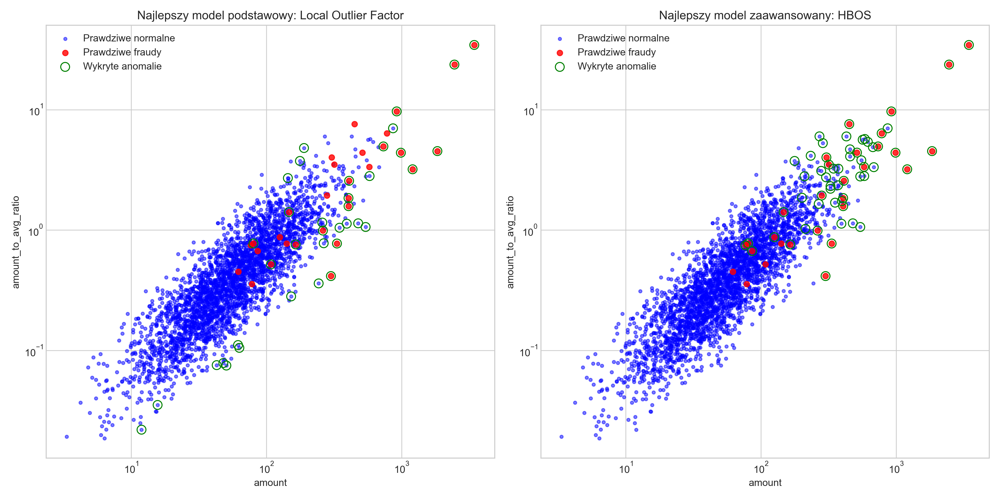

# System Detekcji Anomalii w Transakcjach Bankowych


## 📊 O Projekcie

Projekt prezentuje kompleksowe rozwiązanie do **wykrywania podejrzanych transakcji bankowych** z wykorzystaniem zarówno podstawowych, jak i zaawansowanych algorytmów uczenia maszynowego do detekcji anomalii. System może być wykorzystany przez instytucje finansowe do wykrywania potencjalnych oszustw w czasie rzeczywistym.



## 🌟 Kluczowe Funkcjonalności

- Generowanie realistycznych danych transakcji bankowych z zadanym odsetkiem anomalii
- Eksploracyjna analiza danych (EDA) z wizualizacjami charakterystyk transakcji
- Implementacja i porównanie **dwóch kategorii** algorytmów detekcji anomalii:
  
  ### Podstawowe Algorytmy:
  - **Isolation Forest**
  - **Local Outlier Factor**
  - **One-Class SVM**
  
  ### Zaawansowane Algorytmy:
  - **DBSCAN** (Density-Based Spatial Clustering of Applications with Noise)
  - **Elliptic Envelope**
  - **HBOS** (Histogram-Based Outlier Score) - własna implementacja
  - **Ensemble Anomaly Detection** - system łączący kilka algorytmów
  
- Kompleksowa ewaluacja modeli z wykorzystaniem metryk:
  - ROC i AUC
  - Precision-Recall
  - F1-Score
  - Macierz pomyłek
- Wizualizacja wyników i wykrytych anomalii
- Porównanie skuteczności podstawowych i zaawansowanych algorytmów

## 🔧 Technologie

- **Python 3.8+**
- **scikit-learn** - implementacja algorytmów ML
- **pandas** - manipulacja danymi
- **numpy** - operacje numeryczne
- **matplotlib i seaborn** - wizualizacja danych
- **joblib** - serializacja modeli

## 📈 Wyniki

Projekt demonstruje skuteczność różnych algorytmów detekcji anomalii w wykrywaniu fraudów w transakcjach bankowych. Najlepsze rezultaty osiągnęły modele:

| Model                | AUC    | Precision | Recall | F1-Score |
|----------------------|--------|-----------|--------|----------|
| Local Outlier Factor | 0.9483 | 0.5349    | 0.7667 | 0.6301   |
| HBOS                 | 0.9247 | 0.4310    | 0.8333 | 0.5682   |
| Ensemble             | 0.8914 | 0.0097    | 0.9667 | 0.0192   |

## 🚀 Jak uruchomić

```bash
# Klonowanie repozytorium
git clone https://github.com/twojusername/bank-fraud-detection.git
cd bank-fraud-detection

# Instalacja zależności
pip install -r requirements.txt

# Uruchomienie skryptu
python main.py
```

## 📁 Struktura projektu

Na podstawie załączonego zrzutu ekranu, struktura projektu wygląda następująco:

```
bank-fraud-detection/
│
├── main.py                         # Główny skrypt integrujący wszystkie algorytmy
├── advanced_anomaly_detection.py   # Moduł z zaawansowanymi algorytmami
├── anomaly_detection.py            # Pierwotny skrypt z podstawowymi algorytmami
├── README.md                       # Ten plik
├── requirements.txt                # Zależności projektu
├── model_comparison.csv            # Tabela porównawcza wszystkich modeli
├── model_results.json              # Szczegółowe wyniki w formacie JSON
│
├── data/                           # Katalog na dane
│   └── transactions.csv            # Wygenerowane dane transakcji
│
├── results/                        # Katalog z wizualizacjami i wynikami
│   ├── all_pr_curves.png           # Krzywe Precision-Recall dla wszystkich modeli
│   ├── all_roc_curves.png          # Krzywe ROC dla wszystkich modeli
│   ├── anomaly_detection.png       # Wizualizacja wykrytych anomalii
│   ├── best_models_comparison.png  # Porównanie najlepszych modeli
│   ├── confusion_matrices.png      # Macierze pomyłek
│   ├── correlation_matrix.png      # Macierz korelacji cech
│   ├── eda_plots.png               # Wykresy eksploracyjne
│   ├── model_metrics_comparison.png # Porównanie metryk dla wszystkich modeli
│   ├── pr_curves.png               # Krzywe Precision-Recall dla podstawowych modeli
│   └── roc_curves.png              # Krzywe ROC dla podstawowych modeli
│
|── best_model_hbos.pkl             # Zapisany najlepszy model (HBOS)
└── best_model_local_outlier_factor.pkl # Zapisany najlepszy model (LOF)
```

## 🧠 Proces analityczny

1. **Generowanie danych** - tworzenie realistycznego zbioru transakcji z określonym procentem fraudów
2. **Eksploracja danych** - analiza rozkładu kwot, częstości fraudów w kategoriach, według godzin itp.
3. **Inżynieria cech** - przygotowanie danych, przekształcenia, skalowanie
4. **Modelowanie podstawowe** - implementacja trzech podstawowych algorytmów detekcji anomalii
5. **Modelowanie zaawansowane** - implementacja czterech zaawansowanych algorytmów, w tym własnej implementacji HBOS
6. **Ewaluacja** - porównanie skuteczności modeli, analiza metryk
7. **Wizualizacja** - graficzna prezentacja wyników i wykrytych anomalii
8. **Wnioski** - interpretacja rezultatów i rekomendacje

## 💡 Wnioski i wyzwania

W projekcie zidentyfikowano kilka kluczowych czynników wpływających na skuteczność detekcji fraudów:

1. **Niezbalansowanie klas** - typowy problem w wykrywaniu anomalii, gdzie większość transakcji jest legalna
2. **Kompromis między precision i recall** - zwiększanie czułości systemu prowadzi do większej liczby fałszywych alarmów
3. **Znaczenie inżynierii cech** - utworzenie odpowiednich cech (np. stosunek kwoty do średnich wydatków klienta) znacząco poprawia skuteczność

Porównanie algorytmów pokazuje, że:
- **Local Outlier Factor** osiąga najlepszy wynik AUC i F1-score, łącząc wysoką dokładność z dobrą czułością
- **HBOS** (własna implementacja) osiąga dobry kompromis między Precision i Recall
- **Ensemble** ma najwyższą czułość (Recall), ale kosztem większej liczby fałszywych alarmów
- **DBSCAN** jest najszybszy obliczeniowo, ale mniej dokładny w tym zadaniu

## 🔍 Potencjalne rozszerzenia

- Implementacja algorytmów głębokiego uczenia (autoenkodery, RNN)
- Dostosowanie systemu do przetwarzania strumieni danych w czasie rzeczywistym
- Dodanie mechanizmów adaptacyjnych, dostosowujących się do zmieniających się wzorców fraudów
- Integracja z systemami reguł biznesowych dla redukcji fałszywych alarmów
- Implementacja mechanizmu aktywnego uczenia (active learning) dla ciągłego doskonalenia modeli

## Autor

Krzysztof Sikorowski - projekt portfolio z zakresu praktycznego zastosowania uczenia maszynowego w kontekście wykrywania oszustw.